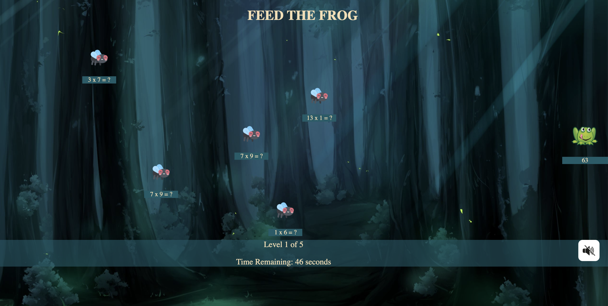

# Expert Math Frog  
Educational game to teach players about multiplication

## :books: Project Description
 
Web application that provide to players 60 seconds to correctly answer a series of math multiplication questions. 

Correctly answering a question advances the user to the next level. 

To win the game, the player must successfully defeat 5 levels of the game within the specified time.

## :woman_office_worker: :man_office_worker: Authors

[Mayank](https://github.com/mayankaryaca)
student ID: 101300566

[Wanja Mascarenhas](https://github.com/mascarenhaswanja)
student ID: 101280022

    
## :gear: Funcionalities

Welcome screen - entry point into the application. Allows the user:
    - Enter name
    - View rules
    - See high scores
    - Choose audio options
    - Start the game

Game screen - The user plays the game. Screen displays:
    - Enemies (Fly)
    - Player  (Frog)
    - Current level
    - Time remaining

High Scores Screen - Displays a list of users who have played the game, and which level they reached.

Rules Screen - Displays a list of the game rules

## :woman_student: :man_student: Students tasks

### 🖼️ Screenshots

## Welcome

 

## Rules

 

## Game

## Scores

 

## :white_check_mark: Attribution
 Expert Math Frog includes screenshots and art from the following sources

    - Images: https://www.gameartguppy.com/
        Background: https://www.gameartguppy.com/shop/jungle-repeatable-horizontal/
        Frog: https://www.gameartguppy.com/shop/frog-lilypad/

    - Sound: https://soundimage.org/wp-content/uploads/2018/08/Rivers-of-Jewels.mp3

    - Icons: https://www.flaticon.com/